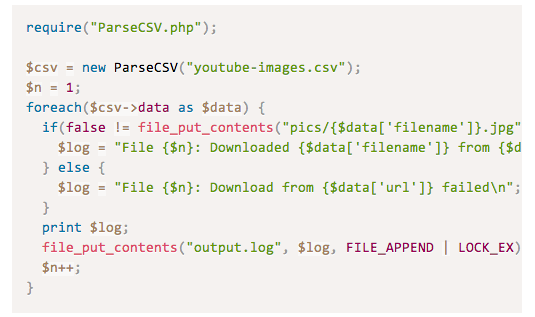

# WP-Gistpen #
**Contributors:** JamesDiGioia
**Donate link:** http://jamesdigioia.com/
**Tags:** gist, code snippets, codepen
**Requires at least:** 3.8
**Tested up to:** 3.9.1
**Stable tag:** 0.1.2
**License:** GPLv2
**License URI:** http://www.gnu.org/licenses/gpl-2.0.html

A self-hosted alternative to putting your code snippets on Gist.

## Description ##

You use WordPress because you want control over your writing. Why give Gist or Codepen your code snippets? WP-Gistpen is a self-hosted replacement for your WordPress blog.

## Installation ##

### Using The WordPress Dashboard ###

1. Navigate to the 'Add New' in the plugins dashboard
2. Search for 'wp-gistpen'
3. Click 'Install Now'
4. Activate the plugin on the Plugin dashboard

### Uploading in WordPress Dashboard ###

1. Download `wp-gistpen.zip` from the WordPress plugins repository.
2. Navigate to the 'Add New' in the plugins dashboard
3. Navigate to the 'Upload' area
4. Select `wp-gistpen.zip` from your computer
5. Click 'Install Now'
6. Activate the plugin in the Plugin dashboard

### Using FTP ###

1. Download `wp-gistpen.zip`
2. Extract the `wp-gistpen` directory to your computer
3. Upload the `wp-gistpen` directory to the `/wp-content/plugins/` directory
4. Activate the plugin in the Plugin dashboard

## Frequently Asked Questions ##

### How does this work? ###

WP-Gistpen registers a new `gistpens` post type. Instead of posting your public code snippets on Gist, go to Gistpens -> Add New, and past in your code. From there, use [gistpen id="##"], where ## is the post id of the Gistpen you just created. (Don't worry, I'm working on streamlining this process :) ).## Screenshots ##

The Insert Gistpen dialog after you click the pen in the visual editor.

How your code will appear in your post.